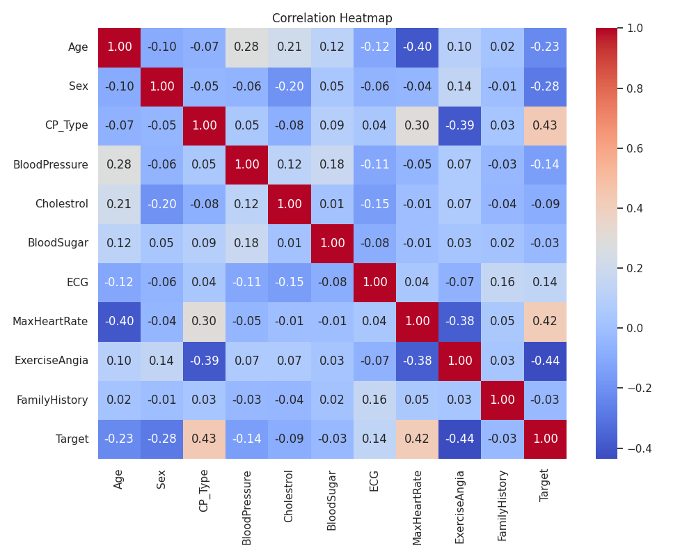

# Heart Attack Analysis and Prediction



## Heart Attack Analysis
1.	Introduction
 A heart attack occurs when an artery supplying your heart with blood and oxygen becomes blocked. A blood clot can form and block your arteries, causing a heart attack. This Heart Attack Analysis helps to understand the chance of attack occurrence in persons based on varied health conditions.
2.	Dataset
The dataset is Heart_Attack_Analysis_Data.csv. It has been added to this. 
This dataset contains data about some hundreds of patients mentioning Age, Sex, Exercise Include Angia(1=YES, 0=NO), Chest Pain Type(Value 1: typical angina, Value2: atypical angina, Value 3: non-anginal pain, Value 4: asymptomatic), ECG Results, Blood Pressure, Cholesterol, Blood Sugar, Family History (Number of persons affected in the family), Maximum Heart Rate, Target -0=LESS CHANCE , 1= MORE CHANCE

## Aim of the assignment is to 

•	Building a Predictive Model    (Which features decide heart attack?)
•	Evaluate the model.
•	Refine the model, as appropriate

## What I need to do?

a)	Select a method for performing the analytic task
b)	Preprocess the data to enhance quality
c)	Carry out descriptive summarization of data and make observations
d)	Identify relevant, irrelevant attributes for building model. 
e)	Perform appropriate data transformations with justifications
f)	Generate new features if needed
g)	Carry out the chosen analytic task. Show results including intermediate results, as needed
h)	Evaluate the solutions
i)	Look for refinement opportunities

## Setup and Running Instructions

### Prerequisites
- Python 3.8+ 
- Required packages listed in `requirements.txt`

### Installation
1. Clone the repository:
   ```
   git clone https://github.com/j143/heart-attack-analysis
   cd heart-attack-analysis
   ```

2. Install dependencies:
   ```
   pip install -r requirements.txt
   ```

### Running the Analysis

#### Quick Start (New CLI Interface)

1. **Set up the project structure:**
   ```bash
   python main.py setup
   ```

2. **Run complete analysis:**
   ```bash
   python main.py analyze
   ```

3. **Run specific components:**
   ```bash
   # Data exploration only
   python main.py explore
   
   # Model training only
   python main.py train --type sklearn
   
   # Model evaluation
   python main.py evaluate
   ```

#### Legacy Compatibility

The original scripts are still available with enhanced functionality:

1. **SystemDS Analysis:**
   ```bash
   python legacy_systemds_analysis.py
   ```

2. **Model Refinement:**
   ```bash
   python legacy_model_refinement.py
   ```

3. **Model Comparison:**
   ```bash
   python legacy_model_comparison.py
   ```

4. **Complete Workflow:**
   ```bash
   python summary.py
   ```

### Key Results

- The original L2SVM achieved ~82% accuracy
- After refinement, the Random Forest model achieved ~95% accuracy
- Key features for predicting heart attacks based on different models:
  - SystemDS Logistic Regression: Age, ECG Results, Sex, MaxHeartRate
  - Refined Random Forest: CP_Type, MaxHeartRate, Age, Cholestrol, BloodPressure

For detailed information about the analysis process and results, please refer to the `solution.md` file.

### Project Structure

```
heart-attack-analysis/
├── src/heart_attack_analysis/          # Main package
│   ├── data_processing/                # Data loading and preprocessing
│   │   ├── __init__.py
│   │   └── data_loader.py
│   ├── modeling/                       # Model training and evaluation
│   │   ├── __init__.py
│   │   └── model_trainer.py
│   ├── visualization/                  # Plotting and visualization
│   │   ├── __init__.py
│   │   └── plotter.py
│   ├── utils/                          # Utility functions
│   │   ├── __init__.py
│   │   └── helpers.py
│   └── __init__.py
├── data/                               # Data files
│   ├── Heart_Attack_Analysis_Data.csv
│   └── README.md
├── outputs/                            # Generated outputs
│   ├── models/                         # Saved models
│   └── plots/                          # Generated plots
├── config/                             # Configuration files
├── tests/                              # Test files
├── main.py                             # CLI interface
├── legacy_*.py                         # Legacy compatibility scripts
├── setup.py                           # Package setup
├── requirements.txt                    # Dependencies
└── README.md                           # This file
```

#### Legacy Scripts (for backward compatibility)
- `legacy_systemds_analysis.py`: Original SystemDS analysis
- `legacy_model_refinement.py`: Model refinement with hyperparameter tuning
- `legacy_model_comparison.py`: Model comparison and evaluation
- `summary.py`: Complete workflow script
- `verify_models.py`: Model validation script

### Visualizations

The analysis generates several visualizations:

- Correlation heatmap
- Feature distributions
- Feature importance plots
- Model performance comparisons
- ROC curves

### Saved Models

The following models are saved during the analysis:

- `logistic_regression_weights.pkl`: Original logistic regression model
- `l2svm_weights.pkl`: Original L2SVM model
- `scaler.pkl`: Data standardization parameters
- `refined_random_forest_model.pkl`: Tuned Random Forest model
- `refined_ensemble_model.pkl`: Ensemble of tuned models

## Conclusion

I have applied ML technique in heart attack analysis. I have utilized systemds and scikit-learn

Key findings:
1. Different models identified different important predictors:
   - Initial models (Logistic Regression): Age, ECG Results, Sex, Maximum Heart Rate
   - Refined models (Random Forest): CP_Type, Maximum Heart Rate, Age, Cholestrol, BloodPressure
2. Hyperparameter tuning and cross-validation improved performance
