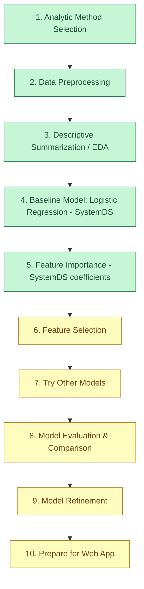

# Heart Attack Analysis: Solution Decision Points

## Progress Checklist

- [x] 1. Analytic Method Selection
- [x] 2. Data Preprocessing
- [x] 3. Descriptive Summarization / EDA
- [x] 4. Baseline Model: Logistic Regression (SystemDS)
- [x] 5. Feature Importance (SystemDS coefficients)
- [ ] 6. Feature Selection
- [ ] 7. Try Other Models
- [ ] 8. Model Evaluation & Comparison
- [ ] 9. Model Refinement
- [ ] 10. Prepare for Web App

## Workflow Diagram

---

This file will be updated as decisions are made and results are obtained during the project.
