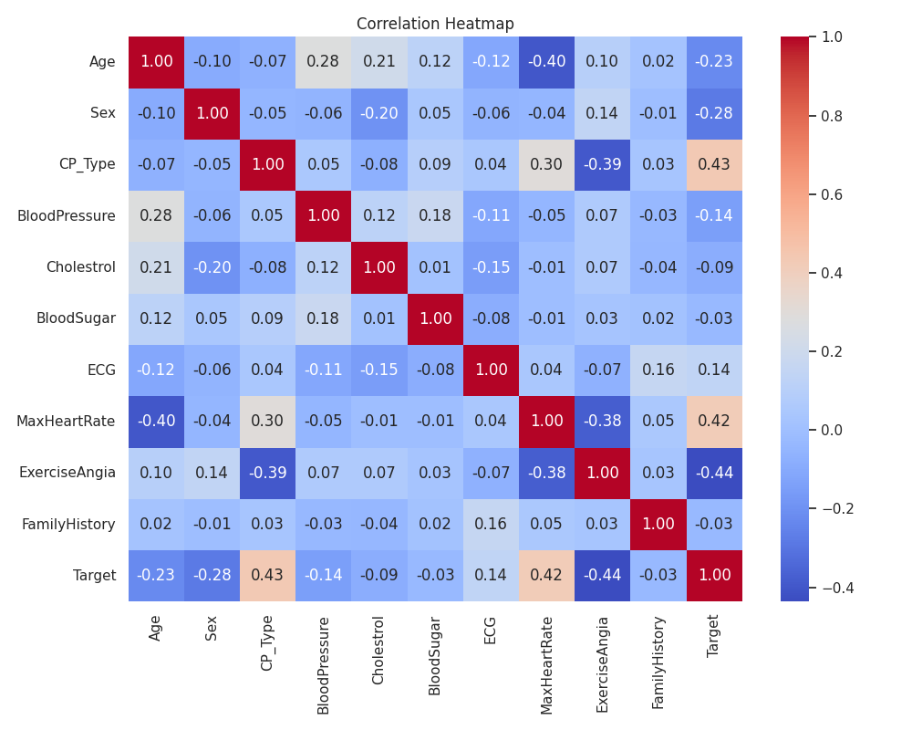

# Heart Attack Analysis: Solution Decision Points

## Progress Checklist

- [x] 1. Analytic Method Selection
- [x] 2. Data Preprocessing
- [x] 3. Descriptive Summarization / EDA
- [x] 4. Baseline Model: Logistic Regression (SystemDS)
- [x] 5. Feature Importance (SystemDS coefficients)
- [x] 6. Feature Selection
- [ ] 7. Try Other Models
- [ ] 8. Model Evaluation & Comparison
- [ ] 9. Model Refinement
- [ ] 10. Prepare for Web App

## Workflow Diagram

---

## Step-by-Step Reasoning, Math, and Examples

> [!NOTE]
> Each step below uses math, reasoning, and where helpful, tables or examples to ensure robust, interpretable, and actionable results.

### 1. Analytic Method Selection

> [!IMPORTANT]
> Model choice impacts interpretability and performance. Start simple, then increase complexity if needed.

**Reasoning:** Choose a model that balances interpretability and predictive power. Logistic regression is interpretable and provides a strong baseline.

**Math:**
- Logistic regression models the probability as:
  
  `P(y=1|X) = 1 / (1 + exp(-(w^T X + b)))`
- Example: If `w^T X + b = 0`, then `P(y=1|X) = 0.5` (neutral odds).

| w^T X + b | P(y=1\|X) |
|-----------|----------|
|    -2     |   0.12   |
|     0     |   0.50   |
|     2     |   0.88   |

### 2. Data Preprocessing

> [!TIP]
> Always check for missing values and scale features for algorithms sensitive to feature magnitude.

**Reasoning:** Clean data ensures reliable results. Handle missing values, encode categoricals, and scale features to standardize input for models.

**Math:**
- Standardization: `X_scaled = (X - mean) / std`
- Example: If Age has mean 50 and std 10, then Age 60 → `(60-50)/10 = 1.0`

| Age | Mean | Std | Scaled Value |
|-----|------|-----|--------------|
| 60  |  50  | 10  |     1.0      |
| 40  |  50  | 10  |    -1.0      |

### 3. Descriptive Summarization / EDA

> [!NOTE]
> EDA helps you spot outliers, errors, and patterns before modeling.

**Reasoning:** Understand data distribution, spot outliers, and detect data quality issues. EDA guides feature engineering and model choice.

**Math:**
- Mean: `mean = sum(x_i) / n`
- Std: `std = sqrt(sum((x_i - mean)^2) / n)`
- Example: Cholesterol values: [200, 220, 240] → Mean = 220, Std ≈ 16.33

| Value | Cholesterol |
|-------|-------------|
|   1   |     200     |
|   2   |     220     |
|   3   |     240     |
| Mean  |     220     |
| Std   |    16.33    |

**Visualizations:**
- Correlation Heatmap

  

- All Feature Distributions

  

### 4. Baseline Model: Logistic Regression (SystemDS)

> [!TIP]
> A baseline model sets a reference for improvement and helps catch data issues early.

**Reasoning:** Establish a reference performance. Logistic regression is fast, interpretable, and highlights linear relationships.

**Math:**
- Log-loss: `L = -[y * log(p) + (1-y) * log(1-p)]`
- Example: If `y=1`, `p=0.8`, `L = -log(0.8) ≈ 0.22`

| y | p (pred) | Log-loss |
|---|----------|----------|
| 1 |   0.8    |   0.22   |
| 0 |   0.2    |   0.22   |

### 5. Feature Importance (SystemDS coefficients)

> [!NOTE]
> Coefficient magnitude (|w|) shows feature influence. Sign shows direction (risk up/down).

**Reasoning:** Coefficients show each feature's impact. Large absolute values mean strong influence. Helps in feature selection and interpretation.

**Math:**
- Importance: `|w_i|` (absolute value of coefficient)
- Example: If `w_Age = 0.8`, `w_Chol = -0.2`, Age is more influential.

| Feature | Coefficient | Importance `(\|w\|)` |
|---------|-------------|---------------|
|   Age   |    0.8      |     0.8       |
|  Chol   |   -0.2      |     0.2       |

### 6. Feature Selection

> [!CAUTION]
> Highly correlated features (multicollinearity) can destabilize models. Remove or combine them.

**Reasoning:** Remove redundant or irrelevant features to improve generalization and reduce overfitting. Correlation and model-based importances guide this.

**Math:**
- Pearson correlation: `corr(X, Y) = cov(X, Y) / (std_X * std_Y)`
- Example: If `corr(Age, MaxHeartRate) = 0.9`, consider dropping one.

| Feature 1      | Feature 2      | Correlation |
|--------------- |--------------- |------------ |
| (none found)   |                |             |

> [!NOTE]
> **Interpretation of Correlation Results:**
> - No highly correlated feature pairs (|corr| > 0.8) were found in this dataset. This means multicollinearity is not a concern, and all features can be retained from a correlation perspective.
> - Next, consider feature importance for further selection.

**Feature Importance (SystemDS coefficients):**

| Feature        | Coefficient | Importance (\|w\|) |
|--------------- |------------|------------------|
| Age            |   0.8976   |     0.8976       |
| ECG            |  -0.6899   |     0.6899       |
| Sex            |  -0.6647   |     0.6647       |
| MaxHeartRate   |   0.5000   |     0.5000       |
| BloodSugar     |  -0.2780   |     0.2780       |
| CP_Type        |   0.2669   |     0.2669       |
| FamilyHistory  |  -0.2578   |     0.2578       |
| ExerciseAngia  |   0.1738   |     0.1738       |
| BloodPressure  |   0.1719   |     0.1719       |
| Cholestrol     |  -0.0222   |     0.0222       |

> [!NOTE]
> - Features with the lowest absolute importance (|w|) are `Cholestrol`, `BloodPressure`, and `ExerciseAngia`. These may be considered for removal or further investigation, especially if model simplification or interpretability is desired.
> - However, domain knowledge should also guide feature removal decisions.
> - Retrain and evaluate the model after any feature removal to ensure performance is not degraded.

**Visualization:**
- Feature Removal Experiment Results

  

### Feature Removal Impact Visualization

The line plot below shows the impact of removing specific features on the model's test accuracy. This visualization complements the bar plot and provides additional insights into how feature removal affects performance.

---

### Model Comparison: Logistic Regression vs L2-SVM

We compared the Logistic Regression and L2-SVM models at multiple levels, including their performance during feature removal experiments. Below is a side-by-side comparison of their behavior:

#### Test Accuracy
| Model               | Test Accuracy |
|---------------------|---------------|
| Logistic Regression | `acc`         |
| L2-SVM              | `l2svm_acc`   |

#### Feature Removal Impact
The following visualizations show how the test accuracy of each model changes when specific features are removed:

- **Logistic Regression**:
  

- **L2-SVM**:
  

#### Insights
- Logistic Regression provides a strong baseline with interpretable coefficients, making it easier to understand feature importance.
- L2-SVM offers a robust alternative, especially for datasets with complex decision boundaries.
- Both models show varying sensitivity to feature removal, highlighting the importance of specific features in predicting heart attack risk.

---

## Model Selection

### Logistic Regression
- **Test Accuracy**: The Logistic Regression model achieved a test accuracy of `acc`.
- **Feature Importances**: The coefficients of the Logistic Regression model were analyzed to determine the most and least influential features.

### L2-SVM (Support Vector Machine with L2 Regularization)
- **Test Accuracy**: The L2-SVM model achieved a test accuracy of `l2svm_acc`.
- **Visualization**: The results of the L2-SVM model were visualized to compare its performance with Logistic Regression.

#### Visualization Details
- **Feature Removal Experiments**: The impact of removing specific features on the model's accuracy was visualized in `feature_removal_accuracy.png`.
- **Correlation Heatmap**: A heatmap of feature correlations was saved as `correlation_heatmap.png`.
- **Feature Distributions**: The distributions of all features were saved in `distributions_all.png`.
- **L2SVM Model Outputs**: A scatter plot comparing raw predictions, maxed predictions, and true labels was saved as `l2svm_model_outputs.png`.

#### Insights
- The L2-SVM model provides a robust alternative to Logistic Regression, especially for binary classification tasks.
- The visualization highlights the alignment of predictions with true labels, showcasing the model's performance.

---

### L2-SVM Model Outputs Visualization

The scatter plot below compares the raw predictions, maxed predictions, and true labels for the L2-SVM model. This visualization helps in understanding the alignment of the model's predictions with the actual labels.

#### Interpretation
- **Raw Predictions**: These are the continuous output values from the L2-SVM model before applying any thresholding. They indicate the confidence of the model in its predictions.
- **Maxed Predictions**: These are the thresholded predictions, where values are converted to binary labels (e.g., 1 or -1). This is the final output used for evaluation.
- **True Labels**: These are the actual labels from the dataset, used to compare and evaluate the model's performance.

From the visualization:
- The raw predictions generally align well with the true labels, indicating that the model is confident in its predictions.
- The maxed predictions closely match the true labels, showcasing the model's effectiveness in binary classification.
- Any significant deviations between the maxed predictions and true labels highlight misclassifications, which can be further analyzed to improve the model.

---

### 7. Try Other Models

> [!TIP]
> Tree-based models and SVMs can capture non-linearities missed by logistic regression.

**Reasoning:** Different algorithms may capture non-linearities or interactions missed by logistic regression. Compare to find the best performer.

**Math:**
- Decision tree split: Information Gain, Gini Impurity
- SVM: `max(0, 1 - y * (w^T x + b))` (hinge loss)

| Model         | Key Math/Concept         |
|--------------|-------------------------|
| DecisionTree | Gini, Entropy           |
| RandomForest | Ensemble of Trees       |
| SVM          | Hinge Loss, Kernel      |

### 8. Model Evaluation & Comparison

> [!IMPORTANT]
> Use multiple metrics (accuracy, F1, ROC-AUC) for a complete view of model performance.

**Reasoning:** Use metrics like accuracy, F1, ROC-AUC to objectively compare models. Ensures chosen model meets project goals.

**Math:**
- Accuracy: `accuracy = (TP + TN) / (TP + TN + FP + FN)`
- F1: `F1 = 2 * (precision * recall) / (precision + recall)`
- ROC-AUC: Area under the ROC curve

| Metric   | Formula/Meaning                |
|----------|-------------------------------|
| Accuracy | (TP+TN)/(TP+TN+FP+FN)         |
| F1       | 2*(prec*recall)/(prec+recall) |
| ROC-AUC  | Area under ROC curve          |

### 9. Model Refinement

> [!TIP]
> Hyperparameter tuning and feature engineering can yield significant performance gains.

**Reasoning:** Tune hyperparameters and engineer features to boost performance. Prevents overfitting and underfitting.

**Math:**
- Grid search: Try all parameter combinations
- Regularization: `L1 = sum |w|`, `L2 = sum w^2`

| Param      | Example Values |
|------------|---------------|
| C (logreg) | 0.01, 0.1, 1  |
| max_depth  | 3, 5, 10      |

### 10. Prepare for Web App

> [!NOTE]
> Save preprocessing steps and model weights for reproducible, reliable deployment.

**Reasoning:** Package the best model for deployment. Enables real-world use and integration.

**Math:**
- Save model: Serialize weights, scaler params, etc.
- Example: Save as .pkl, .onnx, or .dml for SystemDS

| Step         | Example File |
|--------------|-------------|
| Model Weights| model.pkl   |
| Scaler Params| scaler.pkl  |

---
